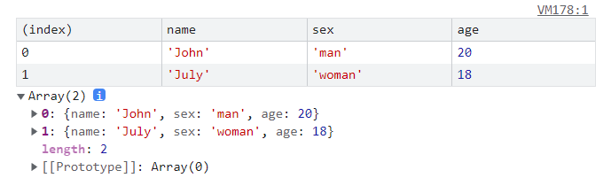
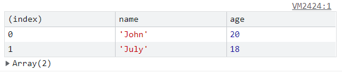

### 1. console.table
在控制台上以表格展示数组或对象，方便查看。`console.table(data [, columns])`
```js 
// 在控制台上运行 
console.table([ 
    { name: 'John', sex: 'man', age: 20 }, 
    { name: 'July', sex: 'woman', age: 18 }, 
])
```
效果截图


当然，你还可以指定展示哪些列
```js 
// 在控制台上运行 
console.table([ 
    { name: 'John', sex: 'man', age: 20 }, 
    { name: 'July', sex: 'woman', age: 18 }, 
], ['name','age'])
```
效果截图


### 2. 复制js数据
当我们需要拷贝**对象数据**时，可以使用`copy(data)`在控制台快速快速复制数据。或者右键控制台输出的数据，点击`Copy Object`，就会自动复制到剪切板中
```js
copy(navigator.userAgentData)
```

### 3.截取一张全屏的网页
偶尔咱们也会有对网页截屏的需求，一屏还好，系统自带的截屏或者微信截图等都可以办到，但是要求**将超出一屏的内容也截下来咋办呢**？

1.  准备好需要截屏的内容
2.  `cmd + shift + p`或者`ctrl + shift + p` 执行`Command`命令
3.  输入`Capture full size screenshot` 按下回车，就可以看到整页长图了

如果要截取选中的部分元素呢？

答案也很简单，第三步输入`Capture node screenshot`即可

### 4.控制台引用上一次执行的结果
来看看这个场景, 对某个字符串进行了各种工序，然后我们想知道每一步执行的结果，该咋办？
```js
// 一系列操作
'javascript'.split('').reverse().join('')
```
使用`$_`引用上一次操作的结果
```js
// 第1步
'javascript'.split('') // ['j', 'a', 'v', 'a', 's', 'c', 'r', 'i', 'p', 't']
// 第2步
$_.reverse() // ['t', 'p', 'i', 'r', 'c', 's', 'a', 'v', 'a', 'j']
// 第3步
$_.join('') // 'tpircsavaj'
```

### 5.一键重新发起请求

在与后端接口联调或排查线上BUG时，你是不是也经常听到他们说这句话：**你再发起一次请求试试，我这边看下为啥出错了！**

重发请求，这有一种简单到发指的方式。

1.  选中`Network`
2.  点击`Fetch/XHR`
3.  选择要重新发送的请求
4.  右键选择`Replay XHR`

> 不用刷新页面，不用走页面交互，是不是非常爽！！！

如果需要简单**修改参数**，可以使用

1. 选中`Network`
2. 点击`Fetch/XHR`
3. 选择`Copy as fetch`
4. 控制台粘贴代码
5. 修改参数，回车搞定